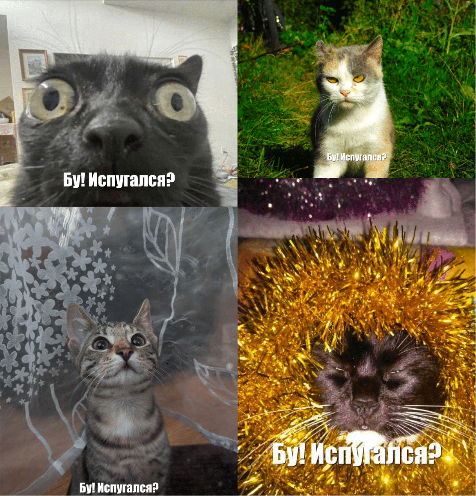

# COT
COT (произносится как `кот`) -- это эксперимент, в котором генерируются картинки с котами и подписью "Бу! Испугался?" и заливаются в s3-хранилище с ограничением на размер бакета.



## Run experiment
```
docker-compose up -d
```

## Results
В файле [report.pdf](report.pdf) содержится информация о результатах эксперимента.
